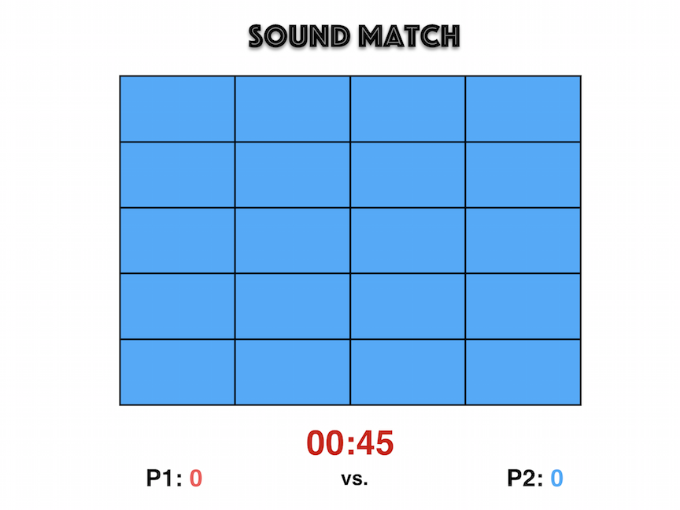
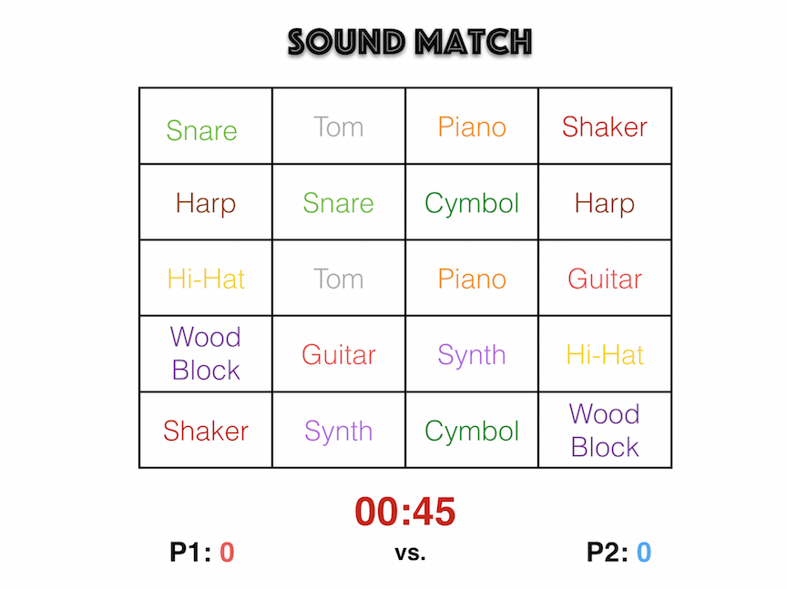
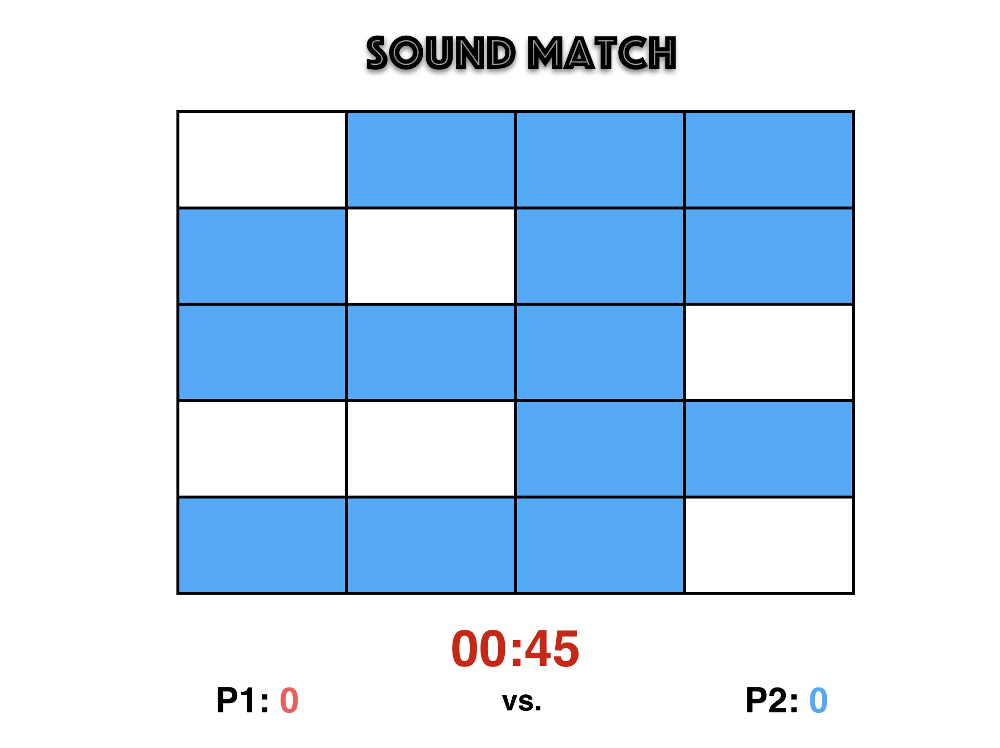
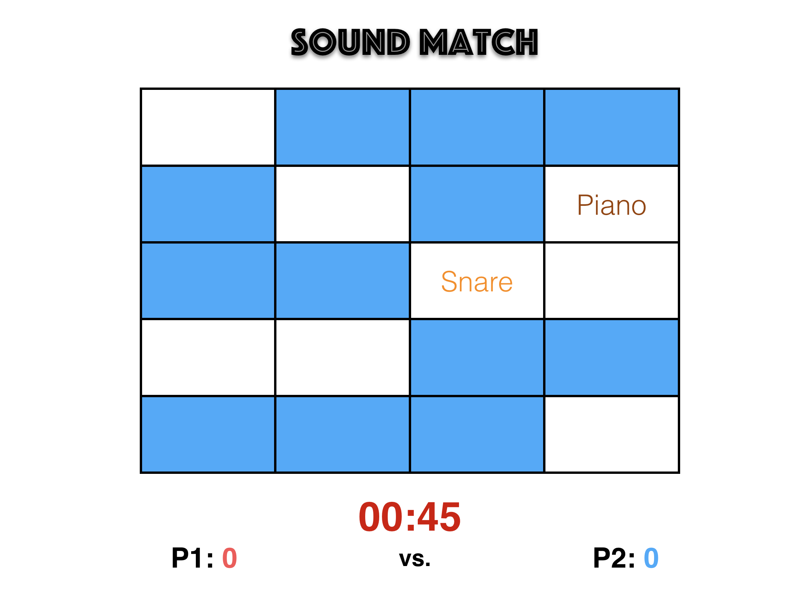
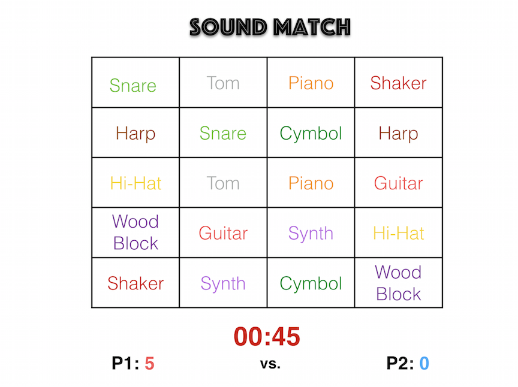
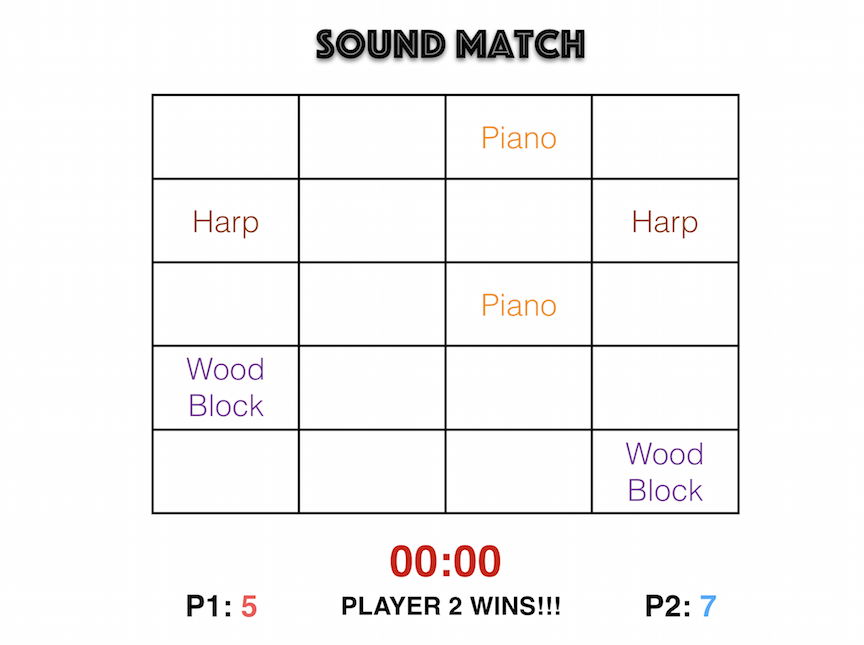

#Game Begins

The game is Sound Match!!! You will attempt to match up more tiles than youre opponent. Each tile contains a sound clip and has a duplicate somewhere else on the board. The game will generate a random order of tiles. A timer is placed at the bottom, and will being counting down once the first tile has been clicked. Below the timer, a counter will keep track of each players total pairs matched. The player who has the most total pairs at the end of the game wins.

#Player 1 Turn

The time will begin when player 1 clicks the first tile. Only 2 tiles can be revealed at once. If the pair is a match the tiles will dispear from the board. If the tiles do not match, both tiles will be hiden again. This is an example of the types of sounds assigned to each tile, but the sounds will not be revealed during gameplay.

#Pairing

When a pair is made, the cards will disapear. Below is an example of how the board will look after several pairs have been made. (Score will be tallied)

#Bad Pair
When a pair does not match the cards revealed will return back to their normal hiden state .5 seconds after being revealed. This is designed to allow the user to see the unmatched pair long enough to register its position on the board without permanently displaying its location. (Thus making it a memory game)

#Time is Up!!

When P1 turn is over, the game will register the ammount of pairs that were made and add it to the score counter. The timer will then reset and prepare for P2 to begin clicking tiles.

#Player 2 Turn

A new random board will be generated in anticipation for P2 to begin clicking tiles. Once the first tile is click the timer will being counting down. 

#Game Over

Once the time runs out, P2 turn will be over. The game will register P2 score and comapre to P1 score. The game will then announce a winner based on the total matches of each player.

